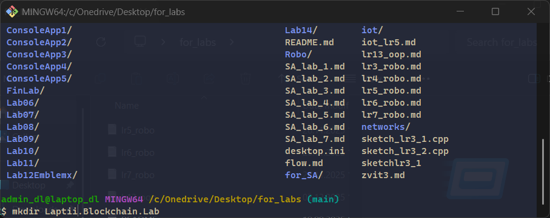
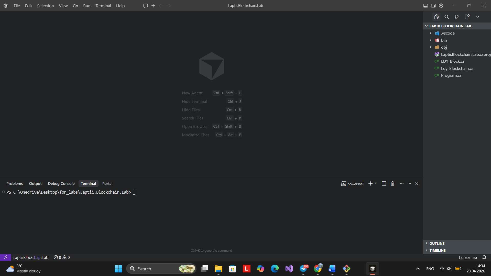
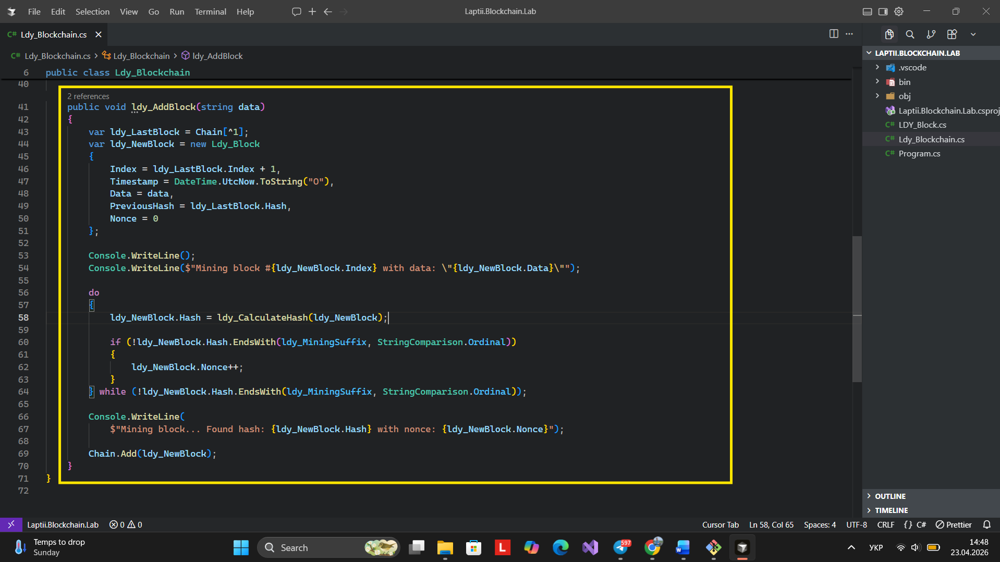
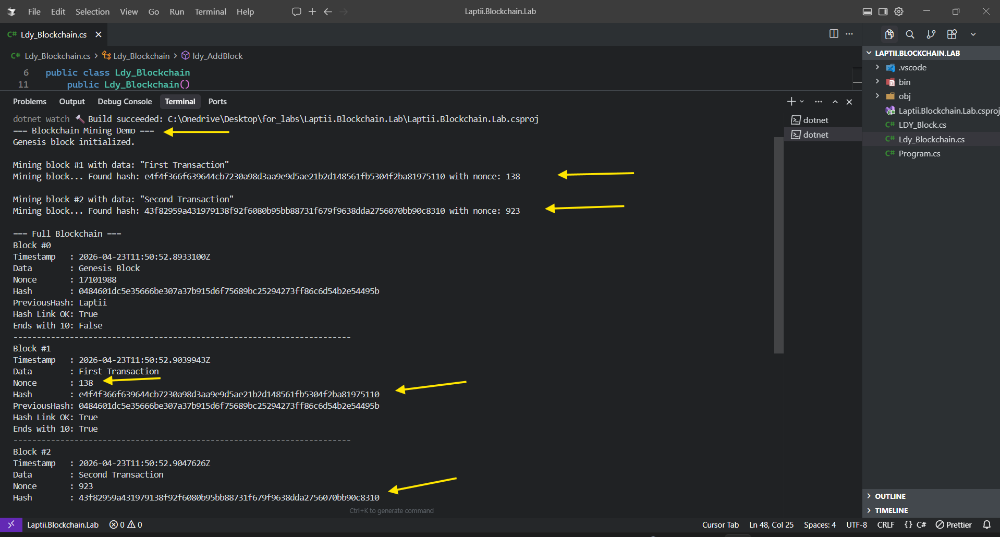
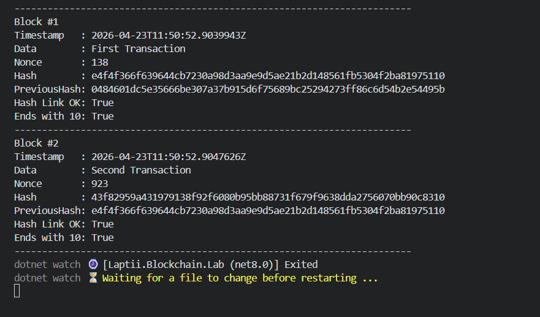

# Звіт з лабораторної роботи №1
**Тема:** Створення прототипу блокчейну та реалізація алгоритму Proof of Work
**Виконав:** Лаптій Д. Є. (LDY)
**Проєкт:** Laptii.Blockchain.Lab

## 1. Мета роботи
Розробити скелет прототипу блокчейну на базі .NET 8, реалізувати обчислення криптографічних хешів SHA-256 та алгоритм консенсусу Proof of Work з індивідуальними параметрами.

## 2. Хід роботи

### 2.1 Налаштування середовища та створення проєкту
Було створено консольний додаток на базі .NET 8. Структура проєкту включає окремі класи для блоку та логіки ланцюга.

### 2.2 Реалізація структури блоку (Ldy_Block)
Клас блоку містить індекс, мітку часу, дані, попередній хеш, nonce та власний хеш. 

### 2.3 Реалізація генезис-блоку та хешування
Відповідно до завдання, генезис-блок ініціалізовано наступними параметрами:
- **PreviousHash:** "Laptii"
- **Nonce:** 17101988 (Дата народження)

### 2.4 Реалізація алгоритму Proof of Work
Реалізовано метод майнінгу `ldy_AddBlock`, який здійснює перебір `Nonce` до моменту, поки хеш блоку не буде відповідати цільовому критерію: завершення на цифри місяця народження (**10**).

## 3. Результати роботи програми
Під час запуску програми було згенеровано генезис-блок та успішно змайнено два наступних блоки. Програма підтвердила валідність зв'язків між блоками (`Hash Link OK: True`) та відповідність хешів заданому критерію.

## 4. Висновки
В ході лабораторної роботи було реалізовано базовий функціонал блокчейну. Програма демонструє принцип незмінності даних (через зв'язок попередніх хешів) та механізм захисту мережі за допомогою обчислювальної складності (PoW).