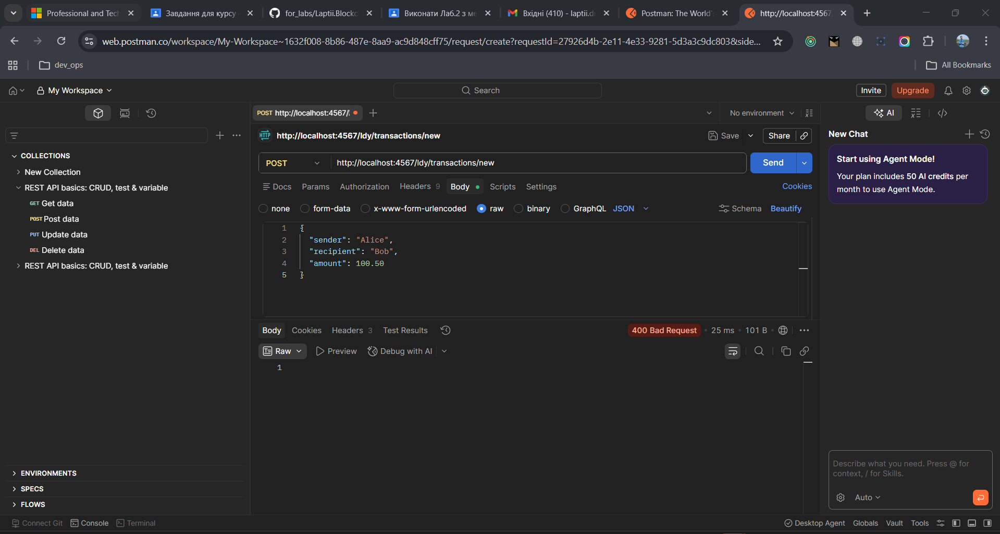
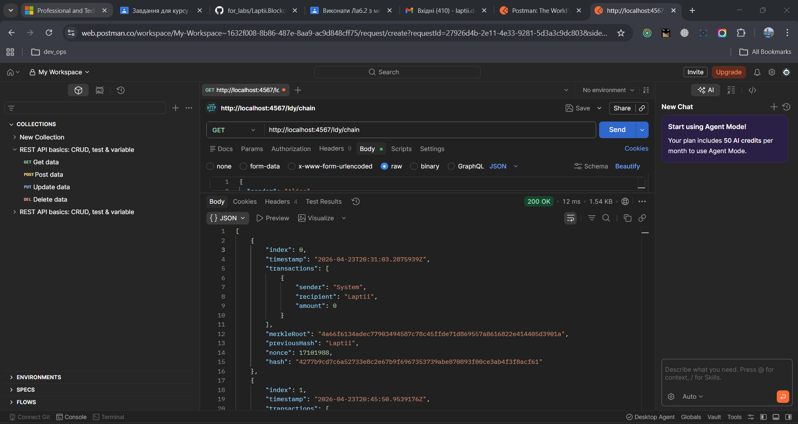

# Звіт з лабораторної роботи №2
**Тема:** Реалізація транзакцій, Мемпулу, Дерева Меркла та REST API сервісу
**Виконав:** Лаптій Д. Є. (LDY)
**Проєкт:** Laptii.Blockchain.Lab

## 1. Мета роботи
Розширити прототип блокчейну підтримкою транзакцій, реалізувати структуру Дерева Меркла для оптимізації зберігання даних та розгорнути REST-сервіс для взаємодії з блокчейном через мережу.

## 2. Виконані завдання

### 2.1 Реалізація моделі транзакцій та Мемпулу
Було створено клас `Ldy_Transaction`. Додано Мемпул (`ldy_mempool`) — тимчасове сховище для транзакцій, які очікують включення в блок.

### 2.2 Дерево Меркла (Merkle Tree)
Реалізовано алгоритм `ldy_CalculateMerkleRoot`, який попарно хешує транзакції. Це дозволяє отримати єдиний хеш-ідентифікатор для всіх даних у блоці.

### 2.3 Побудова REST API
Використовуючи ASP.NET Core Minimal APIs, реалізовано наступні ендпоінти:
- `GET /ldy/chain` — перегляд ланцюга.
- `POST /ldy/transactions/new` — додавання транзакції.
- `GET /ldy/mine` — запуск майнінгу.

## 3. Демонстрація роботи (Скріншоти)

### 3.1 Додавання транзакції через Postman
Надіслано POST-запит із транзакцією: Alice -> Bob (100.50).

### 3.2 Процес майнінгу та обчислення Merkle Root
Після виклику `/ldy/mine` система автоматично додала Coinbase-транзакцію (50 BTC нагороди) та обчислила корінь дерева Меркла.

### 3.3 Результат у форматі JSON
Фінальний стан блокчейну, що містить два блоки з коректними зв'язками та цільовим хешем.

## 4. Висновки
В ході роботи блокчейн було перетворено на інтерактивний сервіс. Реалізація Дерева Меркла забезпечила цілісність транзакцій, а REST API дозволив взаємодіяти з системою зовнішнім клієнтам (Postman).