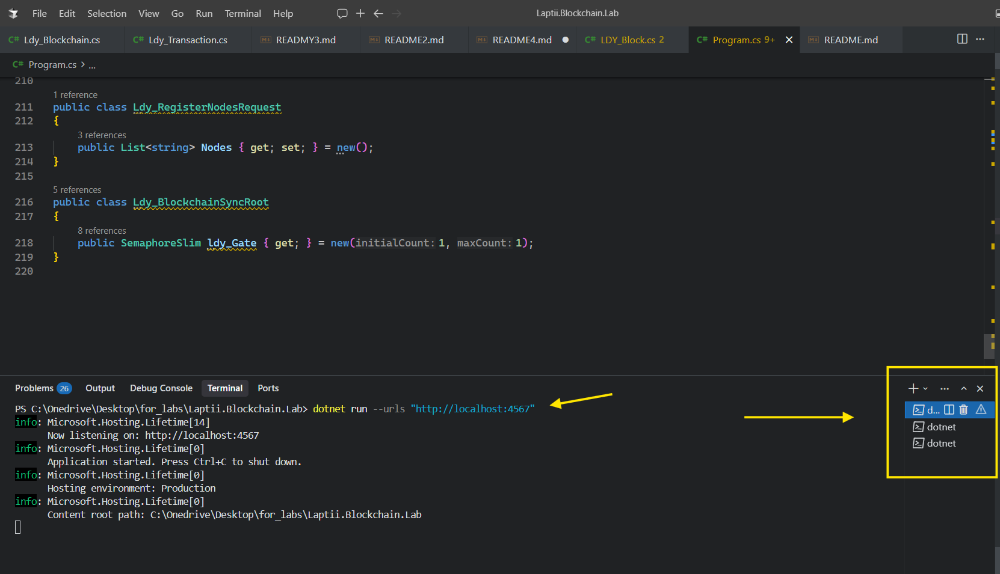
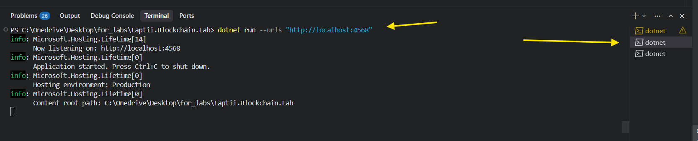
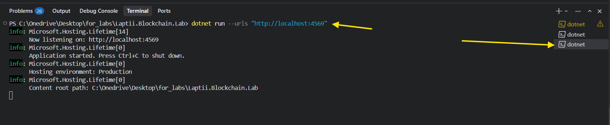
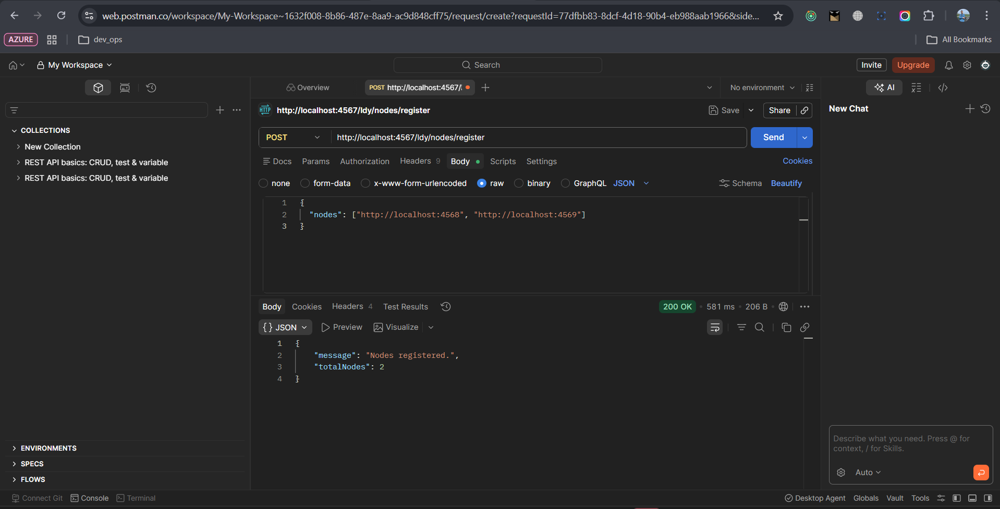
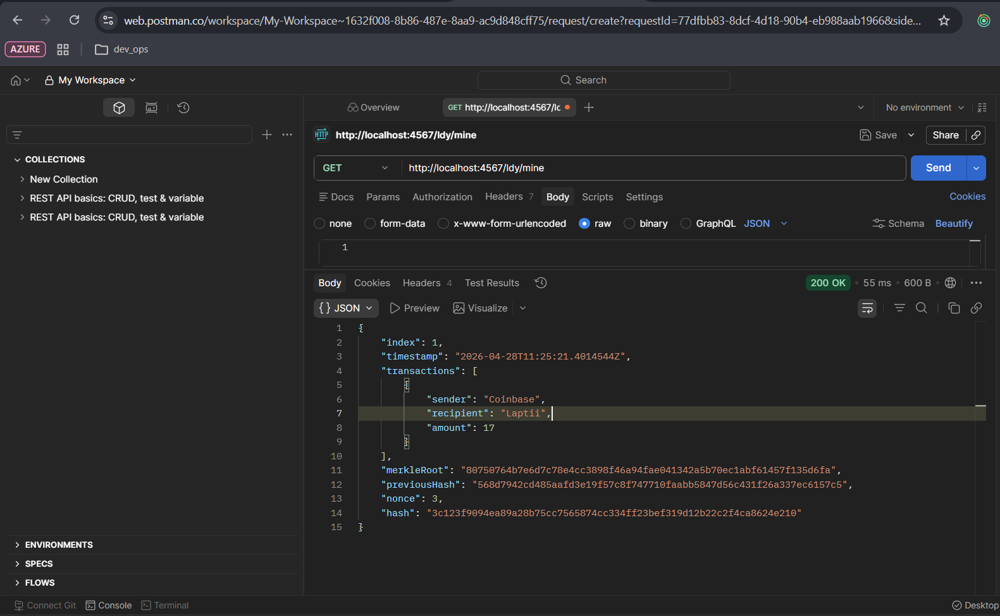
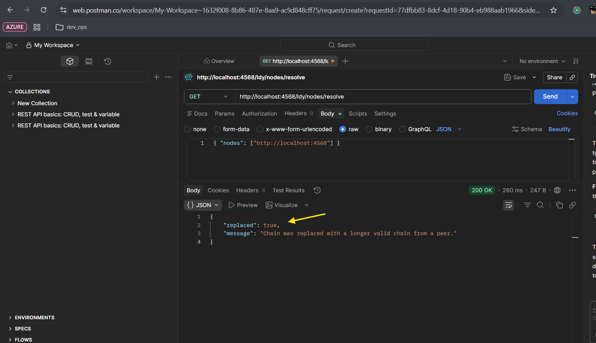
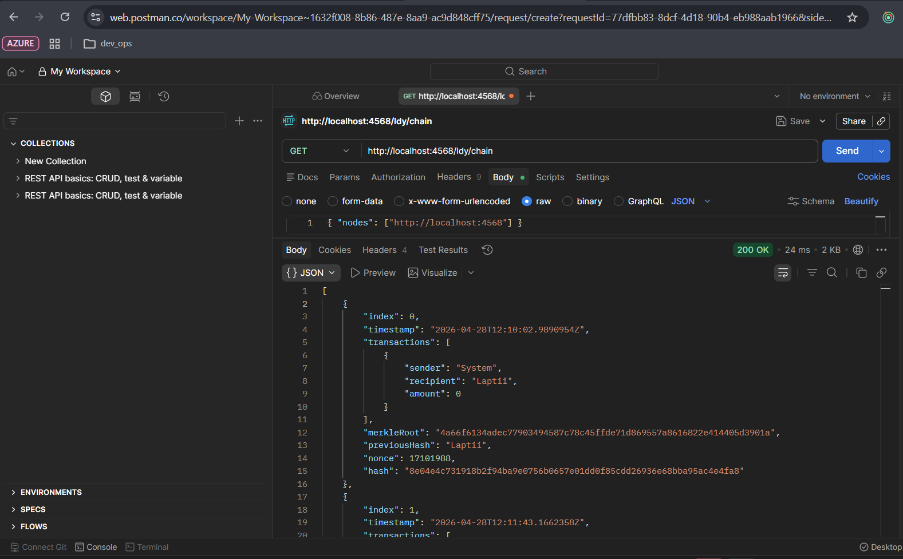

# Звіт з лабораторної роботи №4
**Тема:** Організація консенсусу в децентралізованій мережі блокчейн
**Виконав:** Лаптій Д. Є. (LDY)
**Проєкт:** Laptii.Blockchain.Lab

## 1. Мета роботи
Реалізувати механізми децентралізації та консенсусу для прототипу блокчейну. Навчитися координувати роботу декількох незалежних вузлів мережі за правилом найдовшого ланцюга (Longest Chain Rule).

## 2. Виконані завдання

### 2.1 Конфігурація децентралізованої мережі
Згідно з індивідуальним завданням (місяць народження 10), кількість вузлів розраховано як: `10 / 3 ≈ 3`. 
Для демонстрації мережі було запущено три незалежні екземпляри додатку на різних портах:
- **Вузол 1:** `http://localhost:4567`
- **Вузол 2:** `http://localhost:4568`
- **Вузол 3:** `http://localhost:4569`

### 2.2 Реалізація P2P взаємодії
Додано функціонал реєстрації сусідніх вузлів (`ldy_RegisterNode`). Це дозволяє кожному вузлу знати адреси інших учасників мережі для подальшого обміну даними.
- **Ендпоінт:** `POST /ldy/nodes/register`

### 2.3 Алгоритм консенсусу (Longest Chain Rule)
Реалізовано метод `ldy_ResolveConflicts`, який забезпечує єдність даних у мережі. Алгоритм працює за наступним принципом:
1. Вузол опитує всіх зареєстрованих сусідів.
2. Завантажує їхні версії ланцюга через `GET /ldy/chain`.
3. Перевіряє валідність отриманих ланцюгів.
4. Якщо знайдено ланцюг, довший за локальний — локальні дані замінюються мережевими.

## 3. Результати тестування

### 3.1 Одночасний запуск трьох вузлів
Всі три вузли успішно запущені в окремих терміналах. Кожен вузол має власну ізольовану пам'ять та мемпул.

### 3.2 Реєстрація мережевого оточення
За допомогою Postman вузли були об'єднані в мережу. Вузол 4567 отримав інформацію про 4568 та 4569.

### 3.3 Генерація конфлікту (Асинхронний майнінг)
На **Вузлі 4567** було намайнено новий блок. В цей час **Вузол 4568** все ще містить лише Генезис-блок. Таким чином, у мережі виник конфлікт версій (різна довжина ланцюгів).

### 3.4 Вирішення конфлікту та синхронізація
Після виклику методу `GET /ldy/nodes/resolve` на **Вузлі 4568**, система виявила довший ланцюг у сусіда (4567) і автоматично оновила свою копію блокчейну.
- **Результат:** `replaced: true`

### 3.5 Фінальна перевірка цілісності
Перевірка через `GET /ldy/chain` підтвердила, що всі вузли тепер мають ідентичний набір блоків, включаючи коректні значення `merkleRoot` та `previousHash`.

## 4. Висновки
В ході лабораторної роботи було створено децентралізовану мережу, що складається з трьох автономних вузлів. Реалізований алгоритм консенсусу успішно вирішує конфлікти версій даних, забезпечуючи "єдину істину" для всіх учасників мережі. Всі методи реалізовані з префіксом `ldy_`.