# Звіт з лабораторної роботи №5
**Тема:** Транзакції в блокчейні Bitcoin
**Мета:** Ознайомитися із тестовою мережею Bitcoin та механізмом проведення транзакцій.

## Примітка щодо використання ресурсів
У завданні до лабораторної роботи було вказано використання сервісу **Block.io**. Проте, під час виконання роботи було виявлено, що Block.io повністю інтегрував свій функціонал у платформу **Chain.so**, а пряма реєстрація нових онлайн-гаманців через старий інтерфейс наразі обмежена або перенаправляє на API-документацію. 

Для забезпечення повноцінного виконання всіх пунктів завдання (генерація ключів, отримання монет та підпис транзакцій) було прийнято рішення використовувати інструменти **Coinb.in** (для роботи з адресами та підпису) та **Chain.so** (як основний експлорер для моніторингу мережі **Bitcoin Testnet**). Це дозволило продемонструвати всі етапи життєвого циклу транзакції в ручному режимі, що дає глибше розуміння протоколу Bitcoin.

---

## 1. Створення тестового гаманця
Для генерації пари ключів використано розділ "New Address" на Coinb.in із попереднім перемиканням мережі на **Testnet**.

1. **Мережа:** Bitcoin Testnet.
2. **Адреса (Public Address):** `m/n...` (приклад: `mkiY8LU9ZSTmZ6isAt7CHV9vMpsf77S55t`).
3. **Приватний ключ (WIF):** збережено для подальшого використання у контрольному завданні.

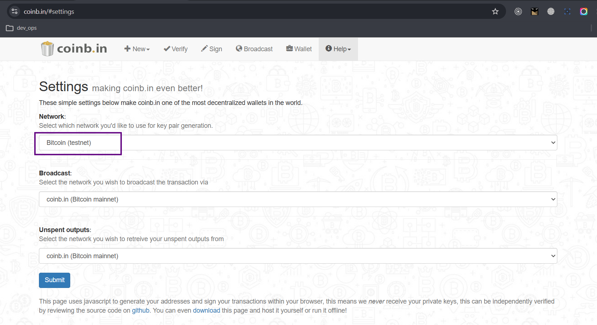
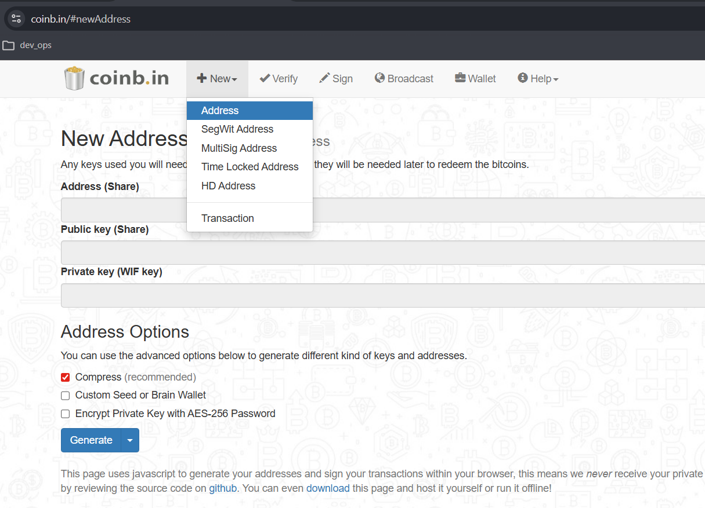
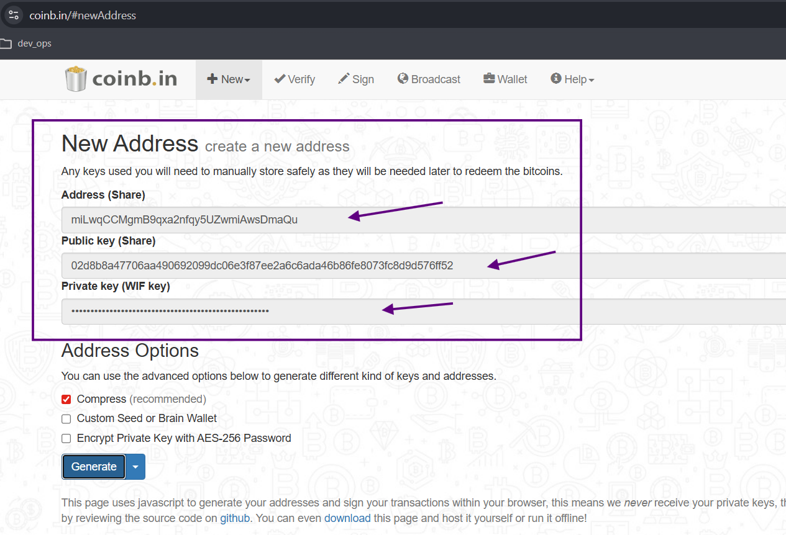
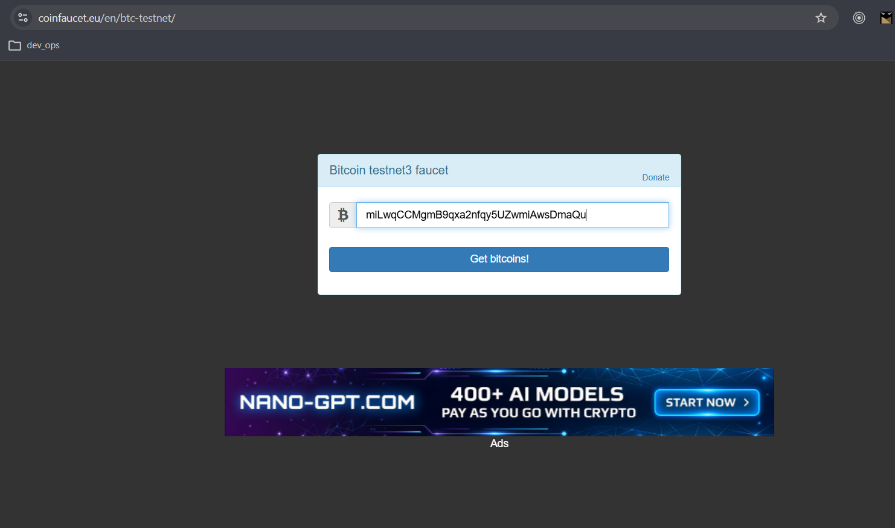
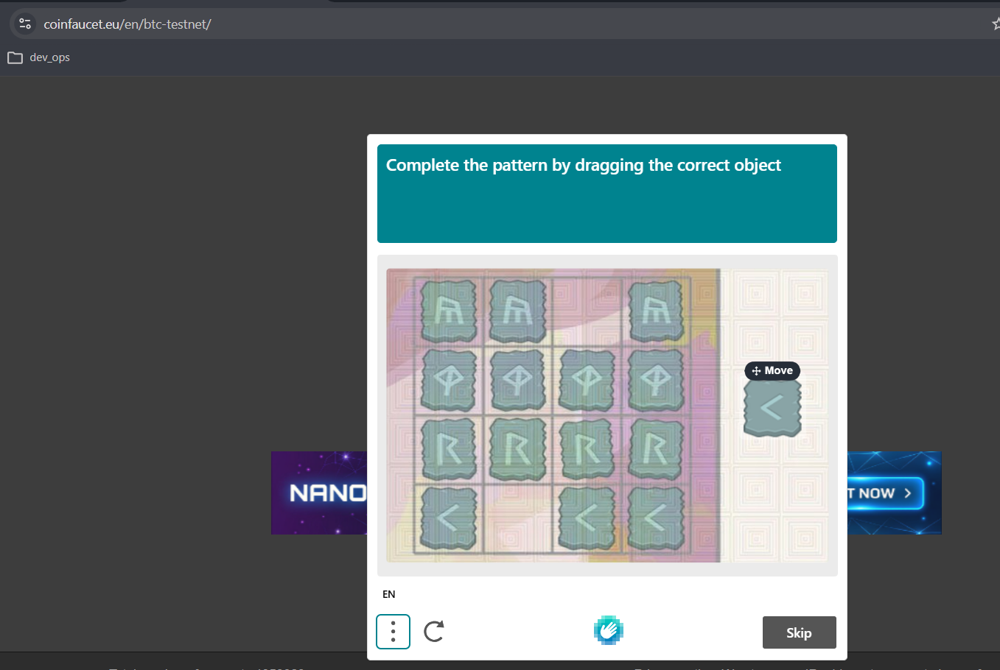
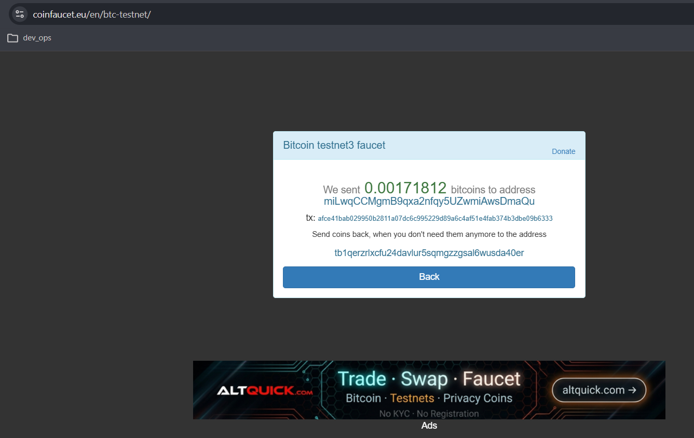
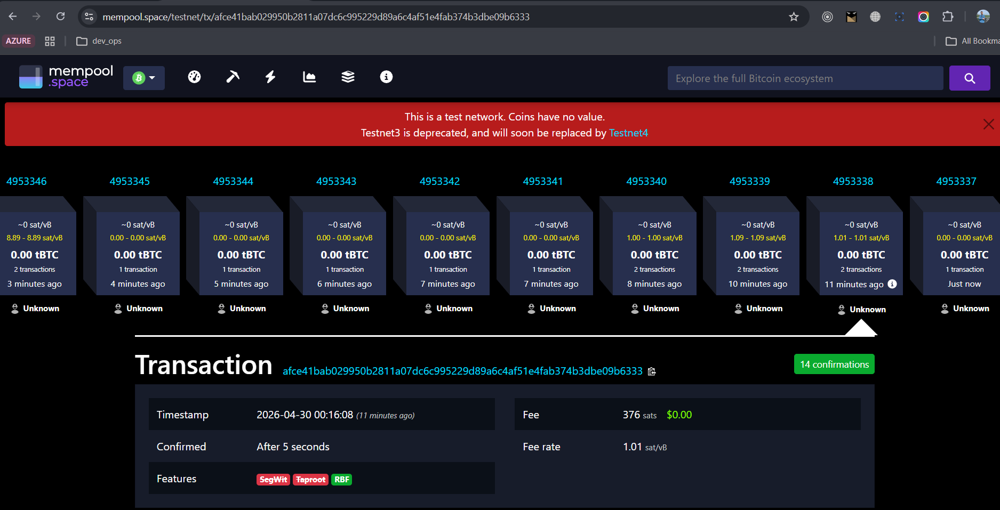
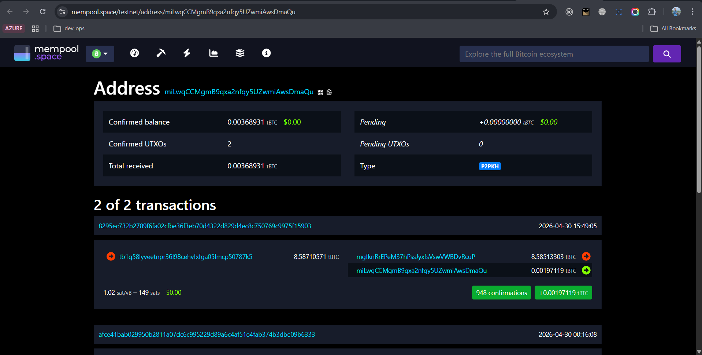
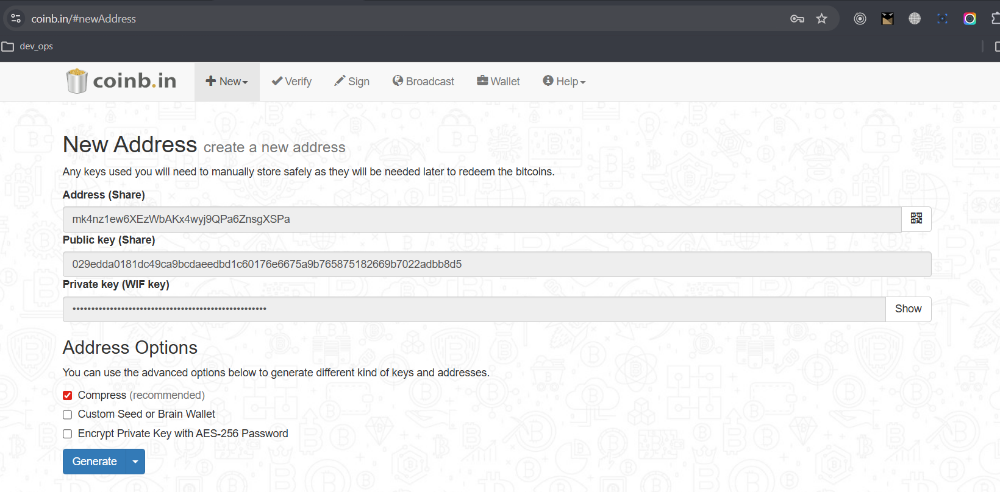

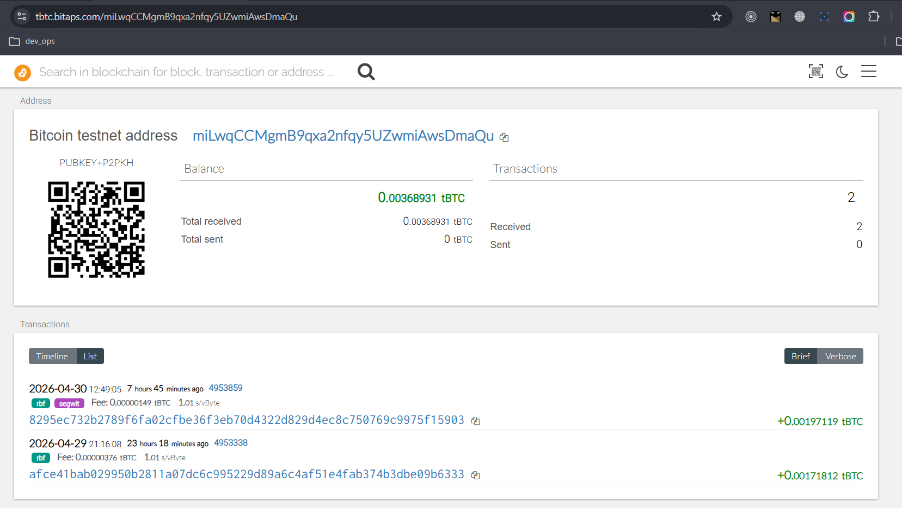
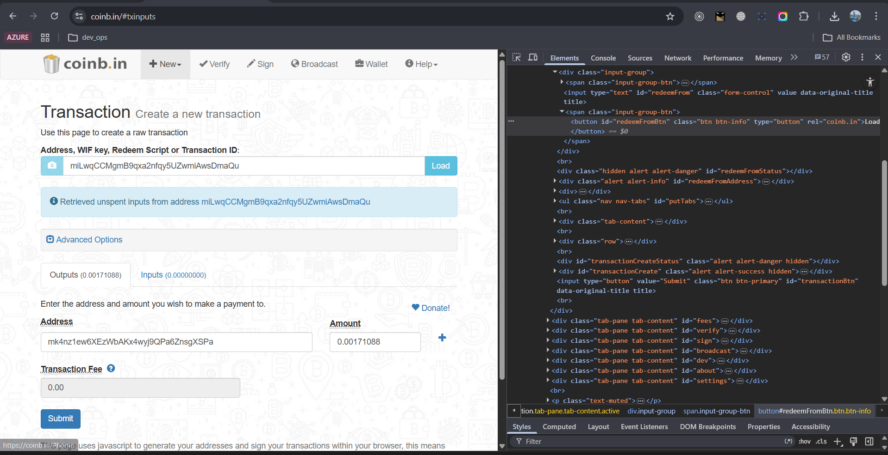
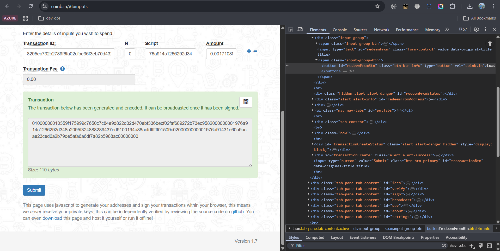
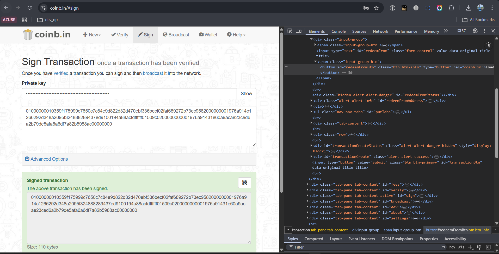

## 2. Отримання тестових монет
Отримання коштів проведено через публічний кран (Faucet), що розповсюджує монети в мережі Testnet.

1. Адресу гаманця було введено у форму запиту крану.
2. Після підтвердження відправки транзакція з'явилася в блокчейн-експлорері **Chain.so**.
3. Статус транзакції: **Confirmed**.

## 3. Виконання контрольного завдання (Передача монет)
Відповідно до завдання, було здійснено зарахування коштів з крану на базовий гаманець і спроба переказу коштів на іншу тестову адресу - нажаль неуспішно. Сума транзакції розрахована за формулою `0.[деньмісяцьрік]` (але в процесі роботи була змінена через мою помилку).

## Висновок
Під час виконання роботи було досліджено роботу мережі Bitcoin Testnet. Використання Chain.so та Coinb.in замість застарілого інтерфейсу Block.io дозволило не лише виконати завдання, а й детально розібрати процес створення та підпису транзакцій "вручну". Всі етапи — від генерації адреси до верифікації транзакції в блокчейні — успішно завершені.