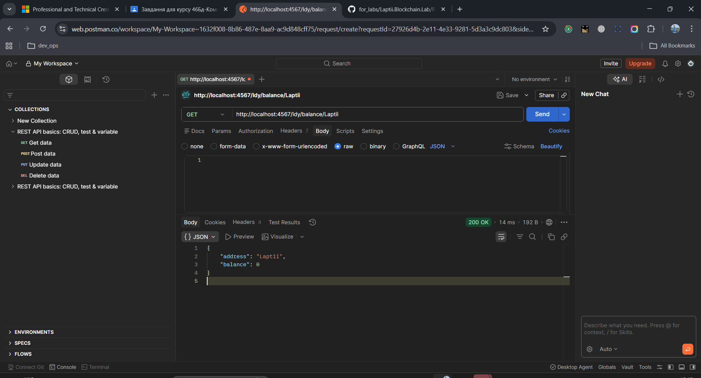
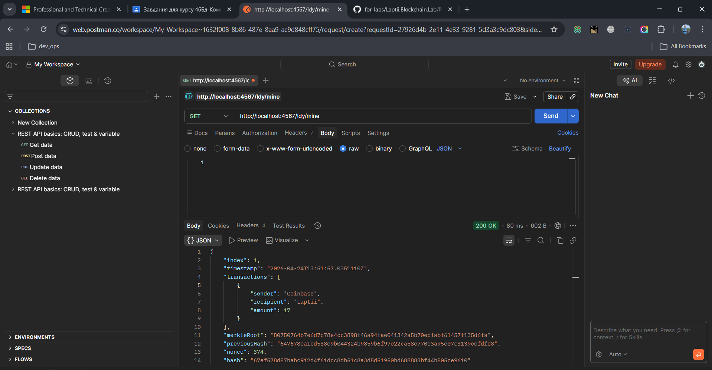
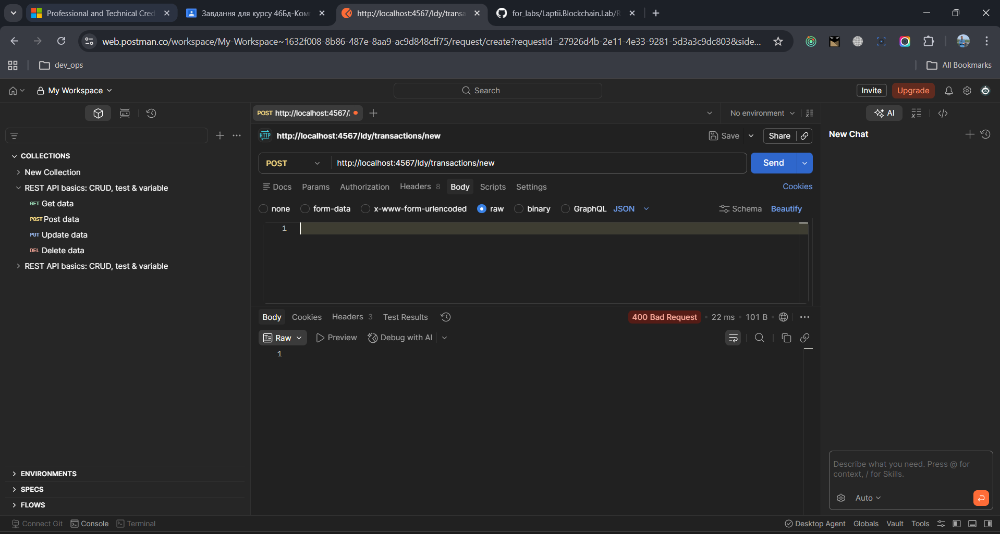
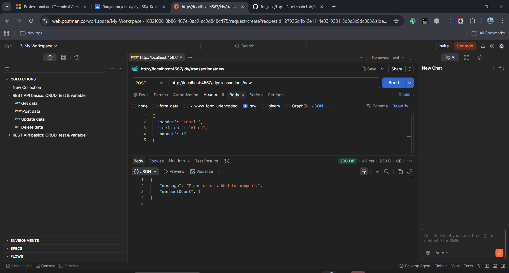

# Звіт з лабораторної роботи №3
**Тема:** Взаємодія з прототипом блокчейну засобами Postman
**Виконав:** Лаптій Д. Є. (LDY)
**Проєкт:** Laptii.Blockchain.Lab

## 1. Мета роботи
Ознайомитися з додатком Postman, навчитися взаємодіяти з блокчейном за допомогою HTTP-запитів, реалізувати перевірку балансу ("наявної каси") та індивідуальні винагороди за майнінг.

## 2. Виконані завдання

### 2.1 Налаштування індивідуальної винагороди
Згідно з контрольним завданням, суму винагороди за майнінг (Coinbase) змінено на **17** (відповідно до дня народження).
- Реалізовано в методі: `ldy_AddBlock`.

### 2.2 Реалізація перевірки балансу
Додано логіку підрахунку "наявної каси" (`ldy_GetBalance`). Система аналізує всі блоки ланцюга для визначення поточного залишку монет на рахунку користувача.
- Ендпоінт: `GET /ldy/balance/{address}`.

### 2.3 Валідація транзакцій
Оновлено метод створення транзакцій: тепер неможливо відправити суму, що перевищує поточний баланс відправника.
- Реалізовано в методі: `ldy_CreateTransaction`.

## 3. Демонстрація роботи в Postman

### 3.1 Початковий стан та запуск сервісу
Сервер запущено на стандартному порту 4567. Початковий баланс користувача Laptii дорівнює 0.

### 3.2 Майнінг та отримання винагороди
Виконано запит на майнінг нового блоку. Отримано винагороду в розмірі 17 монет.

### 3.3 Перевірка обмежень "наявної каси"
Спроба відправити 20 монет (більше, ніж є на балансі) призвела до відхилення транзакції сервером.

### 3.4 Успішна передача монет
Транзакцію на 17 монет успішно підтверджено та додано до ланцюга після перевірки балансу.

## 4. Висновки
В ході роботи відпрацьовано навички тестування API через Postman. Реалізовано механізм контролю емісії та цілісності каси, що робить прототип блокчейну захищеним від створення невалідних транзакцій. Всі компоненти починаються ідентифікатором `ldy_`.