# Лабораторна робота №2

## Тема
Компіляція ядра Linux.

## Мета
Ознайомитися з вихідним кодом ядра Linux, його конфігурацією та процесом компіляції.

---

## 1–2. Встановлення Linux та перегляд поточної версії ядра

Для виконання лабораторної роботи використано віртуальну машину з Debian 13 ARM64.

Поточну версію ядра та інформацію про систему було переглянуто командами `uname -r`, `uname -a` та `hostnamectl`.

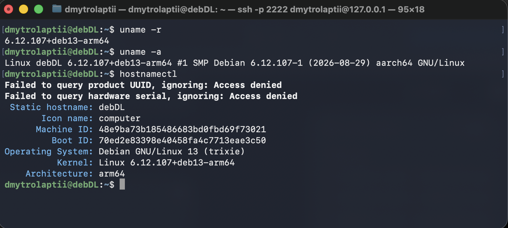

---

## 3–5. Завантаження нового ядра, перегляд вихідних текстів та розпакування архіву

З офіційного сайту kernel.org було обрано та завантажено нову версію ядра Linux.

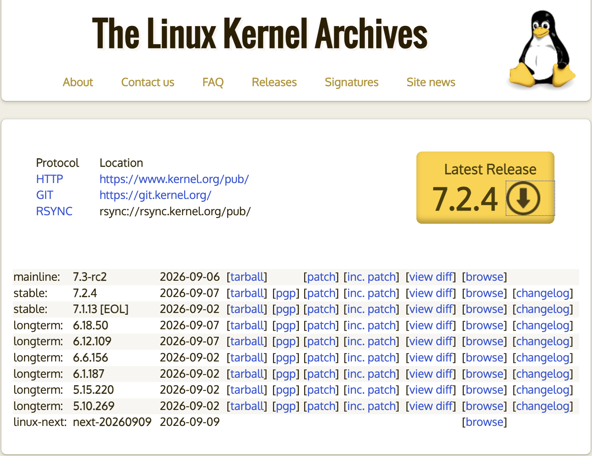

Архів з вихідним кодом ядра було завантажено у віртуальну машину.

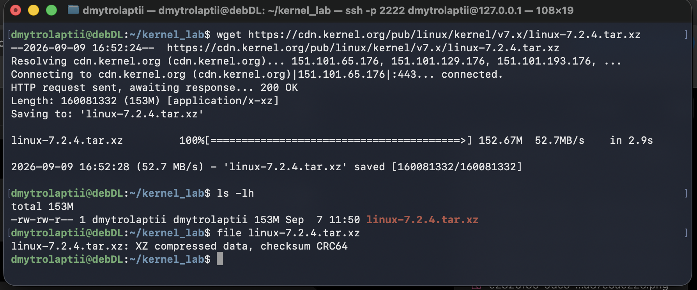

Архів `linux-7.2.4.tar.xz` було розпаковано за допомогою команди `tar -Jxf`.

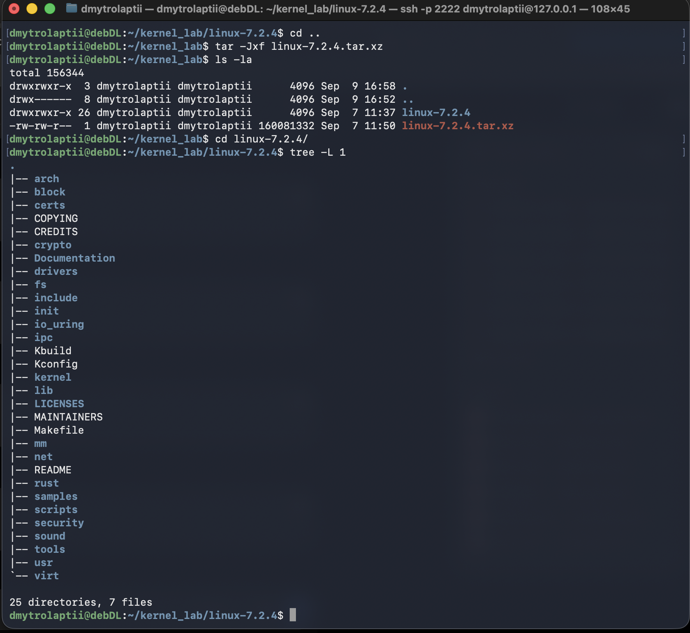

Після розпакування було переглянуто дерево каталогу вихідних текстів ядра Linux.

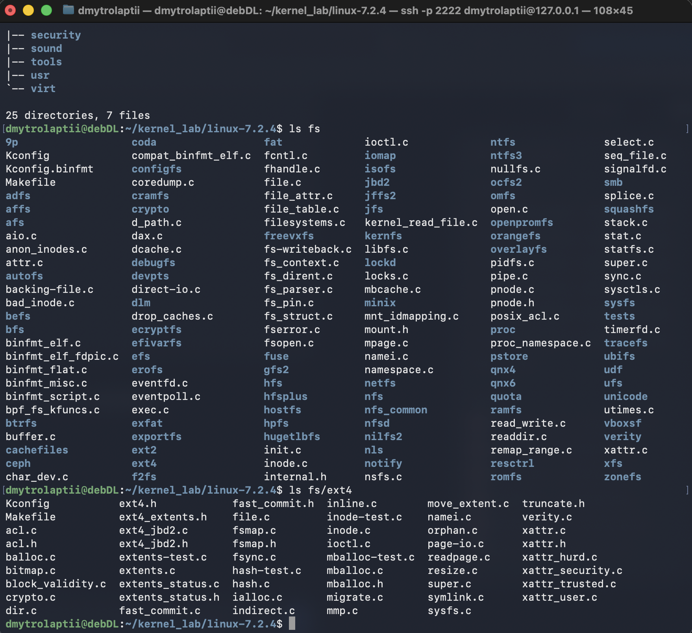

---

## 6. Встановлення додаткових пакетів

Для конфігурації та компіляції ядра було встановлено необхідні пакети: компілятор, `make`, бібліотеки для `nconfig`, а також додаткові інструменти збірки.

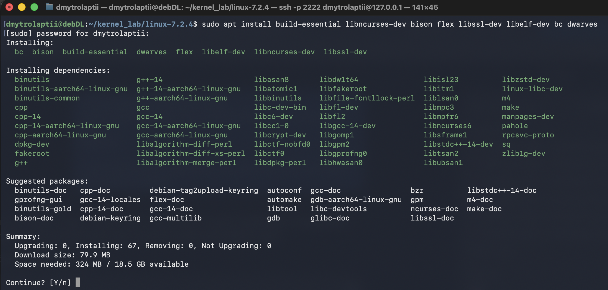

---

## 7–9. Конфігурація ядра та зміна параметра EXT4

Було запущено конфігуратор ядра командою `make nconfig`.

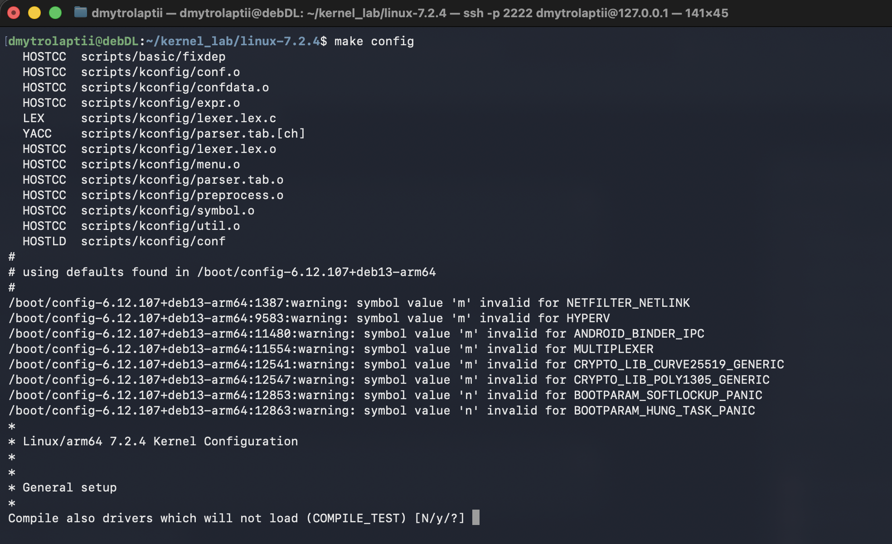

У розділі файлових систем було знайдено параметр підтримки EXT4.

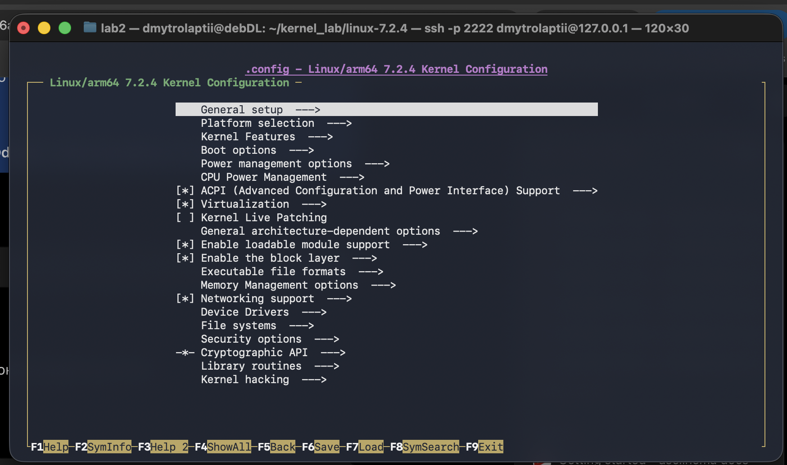

Початково підтримка EXT4 була налаштована як модуль:

`<M> The Extended 4 (ext4) filesystem`

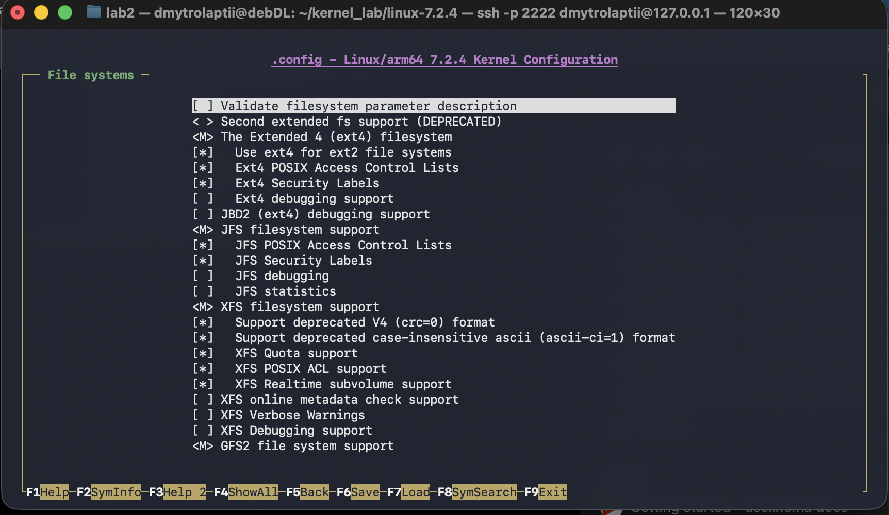

Параметр було змінено таким чином, щоб підтримка EXT4 була включена безпосередньо до ядра:

`<*> The Extended 4 (ext4) filesystem`

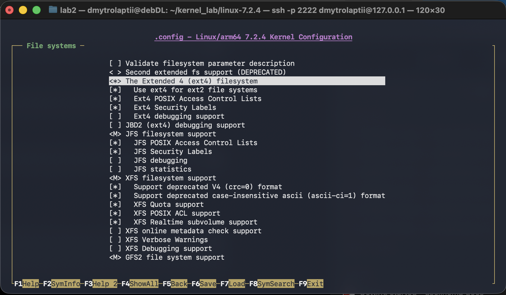

Після збереження конфігурації було перевірено значення `CONFIG_EXT4_FS`.

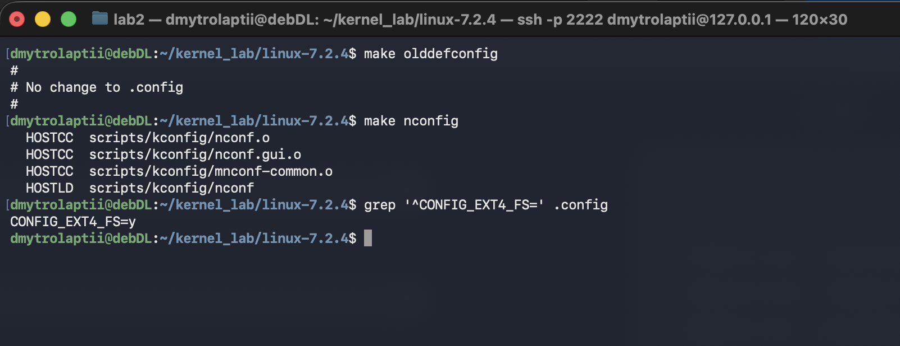

---

## 10–11. Компіляція ядра та створення образу

Компіляцію ядра було запущено з використанням доступних процесорів командою:

`make -j$(nproc)`

Під час збірки було успішно створено образ ядра для архітектури ARM64:

`arch/arm64/boot/Image`

а також його стиснену версію:

`arch/arm64/boot/Image.gz`

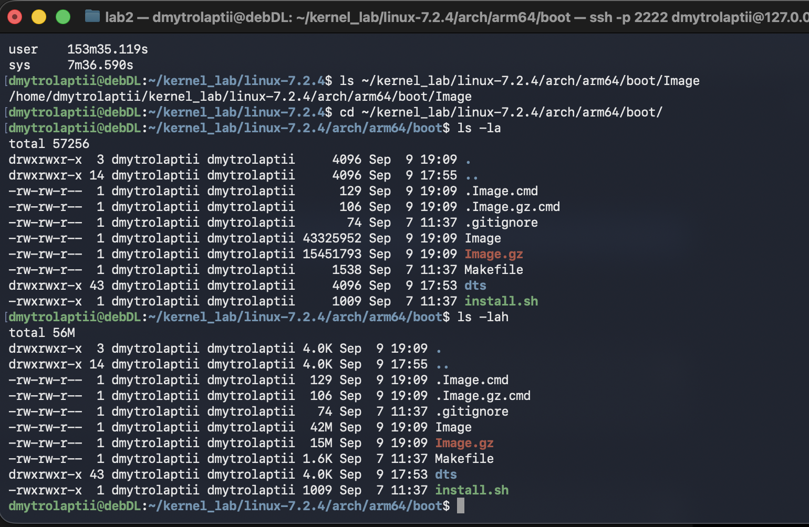

Оскільки лабораторна робота виконується на архітектурі ARM64, результат збірки розміщується в каталозі:

`arch/arm64/boot/Image`

а не у `arch/x86/boot/bzImage`, як для x86/AMD64.

Під час подальшої збірки модулів процес завершився помилкою `No space left on device`, оскільки на віртуальному диску закінчилося вільне місце.

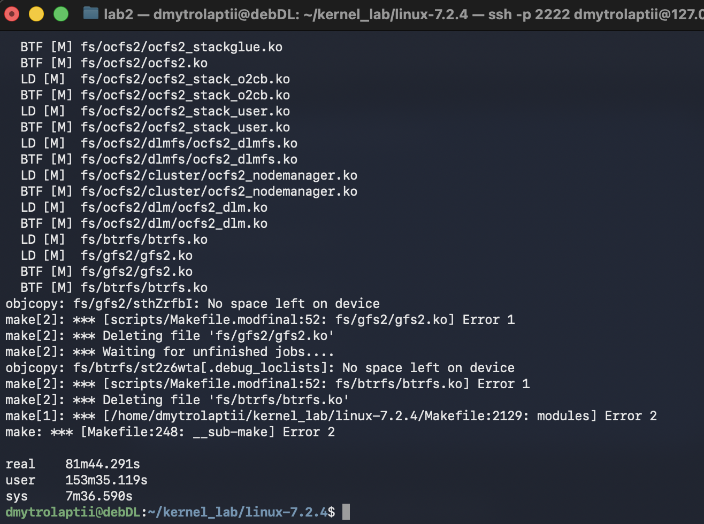

Таким чином, образ ядра було створено успішно, однак повна збірка всіх модулів ядра не завершилася через нестачу дискового простору.

---

## Висновок

У ході лабораторної роботи було переглянуто поточну версію ядра Linux, завантажено вихідний код нового ядра, розглянуто його структуру, встановлено необхідні пакети для збірки, виконано конфігурацію параметрів ядра та змінено налаштування підтримки файлової системи EXT4.

У результаті було створено образ ядра `arch/arm64/boot/Image`. Подальша збірка модулів була перервана через нестачу вільного місця на віртуальному диску.
