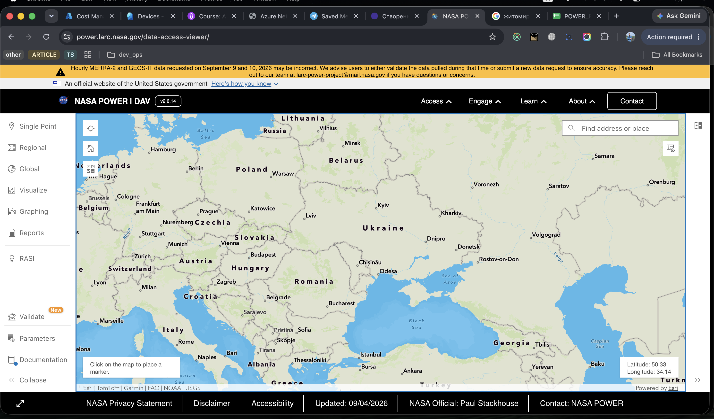
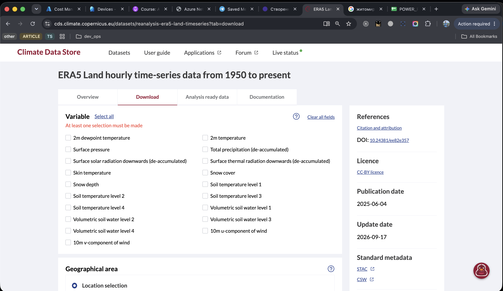
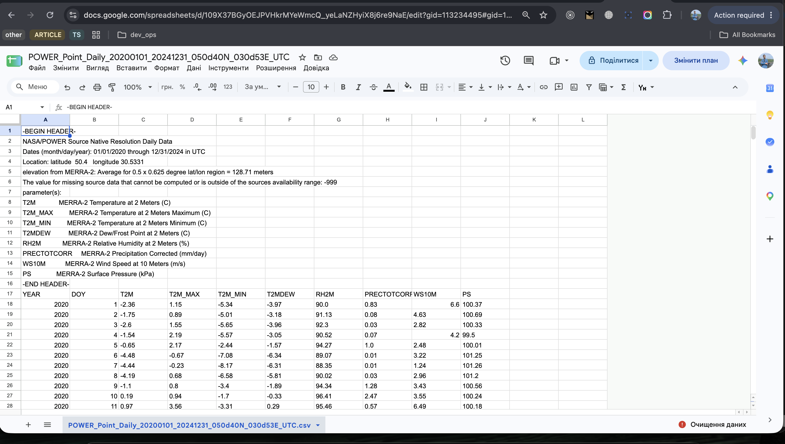
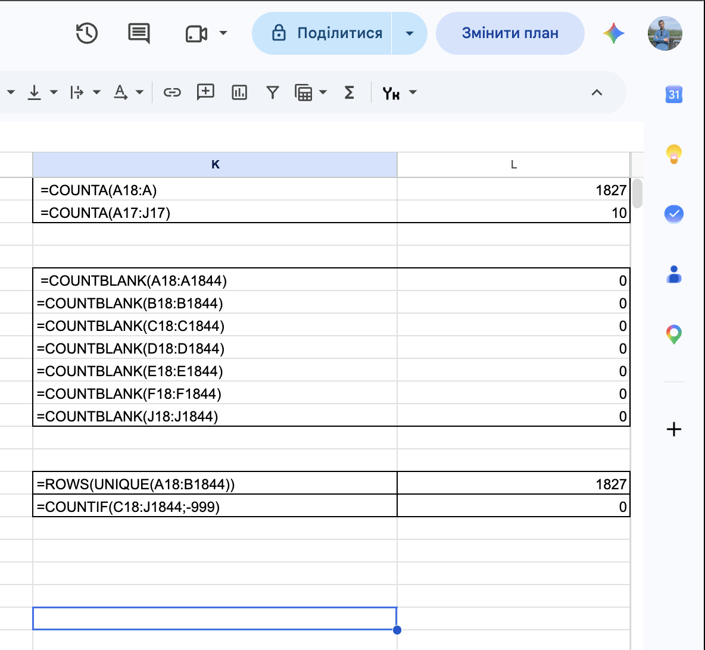

# Звіт до лабораторної роботи №1
## Пошук, завантаження та первинне ознайомлення з даними

## 1. Загальна інформація

**ПІБ:** Дмитро Лаптій 
**Варіант:** 5  
**Тематичний напрям:** Погода  

Для роботи обрано погодні дані для Києва за період **2020–2024 років**. Для пошуку та порівняння використано три джерела: **NOAA NCEI**, **NASA POWER** та **Copernicus CDS / ERA5**.

---

## 2. Пошук і вибір набору

Для порівняння обрано три набори погодних даних приблизно для однієї географічної області та одного часового періоду.

| Назва | Джерело | Записи | Поля | Формат | Обрано |
|---|---|---:|---:|---|---|
| NOAA GHCN Daily — KIEV | NOAA NCEI | 1731 | 155 загалом, 11 заповнених | CSV | Ні |
| NASA POWER Daily | NASA POWER / MERRA-2 | 1827 | 10 | CSV | **Так** |
| ERA5 Hourly Time-Series | Copernicus CDS / ECMWF | 43 848 | 9 | CSV | Ні |

Обрано **NASA POWER Daily**, оскільки набір містить повний щоденний період 2020–2024 років, має компактну структуру та включає основні погодні показники: температуру, вологість, опади, швидкість вітру та атмосферний тиск. Для подальшої роботи він зручніший за NOAA, де є пропущені спостереження, та ERA5, який містить значно більший обсяг погодинних даних.

> **Коментар.** Я спеціально порівнював не випадкові набори, а дані приблизно для однієї локації та одного періоду. Так можна оцінити саме різницю між джерелами і вибрати набір, який буде найбільш зручним для подальшого аналізу.

### Використані джерела

- NOAA GHCN Daily: https://www.ncei.noaa.gov/products/land-based-station/global-historical-climatology-network-daily
- NASA POWER: https://power.larc.nasa.gov/
- Copernicus ERA5: https://cds.climate.copernicus.eu/datasets/reanalysis-era5-single-levels-timeseries

### Отримання даних

**NOAA GHCN Daily**

Дані NOAA були отримані через API NCEI Data Service. Використано станцію `UPM00033345` (KIEV), період 2020–2024 років та метричні одиниці вимірювання.

API-запит для отримання CSV:

https://www.ncei.noaa.gov/access/services/data/v1?dataset=daily-summaries&stations=UPM00033345&startDate=2020-01-01&endDate=2024-12-31&format=csv&units=metric&includeStationName=true&includeStationLocation=true

**NASA POWER**

Дані NASA POWER також були отримані через API. Запит сформовано для координат Києва `50.4 N, 30.5331 E`, щоденного кроку та періоду 2020–2024 років.

API-запит для отримання CSV:

https://power.larc.nasa.gov/api/temporal/daily/point?parameters=T2M,T2M_MAX,T2M_MIN,T2MDEW,RH2M,PRECTOTCORR,WS10M,PS&community=AG&longitude=30.5331&latitude=50.4&start=20200101&end=20241231&format=CSV&time-standard=UTC

**Copernicus ERA5**

Набір ERA5 було завантажено стандартним способом через вебінтерфейс **Copernicus Climate Data Store**. На сайті було вибрано потрібний набір даних, часовий період, метеорологічні параметри та формат файлу, після чого сформований файл було завантажено локально.

### Скріншоти джерел

*Рисунок 1 — Джерело NOAA GHCN Daily.*

*Рисунок 2 — Джерело NASA POWER.*

*Рисунок 3 — Джерело Copernicus ERA5.*

---

## 3. Паспорт обраного набору

| Характеристика | Значення |
|---|---|
| **Назва набору** | NASA POWER Daily |
| **Джерело** | NASA POWER / MERRA-2 |
| **Посилання на набір** | https://power.larc.nasa.gov/ |
| **Тематичний варіант** | 5 — Погода |
| **Тематика даних** | Щоденні метеорологічні показники для Києва |
| **Координати** | 50.4 N, 30.5331 E |
| **Період** | 2020–2024 |
| **Формат файлу** | CSV |
| **Кількість записів** | 1827 |
| **Кількість полів** | 10 |
| **Основні числові поля** | `T2M`, `T2M_MAX`, `T2M_MIN`, `T2MDEW`, `RH2M`, `PRECTOTCORR`, `WS10M`, `PS` |
| **Основні категоріальні / текстові поля** | Відсутні |
| **Поля дати / часу** | `YEAR`, `DOY` |
| **Виявлені проблеми або особливості** | Пропущених значень, значень `-999` та дублікатів за `YEAR + DOY` не виявлено. Окремого поля `DATE` немає — дата визначається комбінацією `YEAR + DOY`. |
| **Можливі запитання для аналізу** | Зміна температури в часі; зв'язок опадів і вологості; зв'язок атмосферного тиску і швидкості вітру |

Обраний CSV було імпортовано у **Google Sheets**. Дані коректно розділилися на окремі стовпці.

*Рисунок 4 — Набір NASA POWER Daily після імпорту в Google Sheets.*

Для первинної перевірки набору було перевірено кількість записів і полів, наявність пропущених значень та можливих дублікатів.

*Рисунок 5 — Первинна перевірка структури та якості даних.*

---

## 4. Структура даних

| Поле | Тип даних | Призначення |
|---|---|---|
| `YEAR` | числовий | рік спостереження |
| `DOY` | числовий | порядковий номер дня в році |
| `T2M` | числовий | середня температура повітря на висоті 2 м, °C |
| `T2M_MAX` | числовий | максимальна температура повітря на висоті 2 м, °C |
| `T2M_MIN` | числовий | мінімальна температура повітря на висоті 2 м, °C |
| `T2MDEW` | числовий | температура точки роси на висоті 2 м, °C |
| `RH2M` | числовий | відносна вологість повітря на висоті 2 м, % |
| `PRECTOTCORR` | числовий | скоригована кількість опадів за добу, мм/день |
| `WS10M` | числовий | швидкість вітру на висоті 10 м, м/с |
| `PS` | числовий | атмосферний тиск біля поверхні, кПа |

> **Коментар.** У наборі немає окремого поля дати. Конкретний день визначається комбінацією `YEAR + DOY`, чого достатньо для однозначного визначення дати та подальшого аналізу часових змін.

---

## 5. Запитання для подальшого аналізу

1. **Як змінювалася середня температура повітря протягом року та між 2020–2024 роками?**
2. **У які періоди спостерігалася найбільша кількість опадів і як вона пов'язана з відносною вологістю повітря?**
3. **Чи існує зв'язок між атмосферним тиском і швидкістю вітру?**
